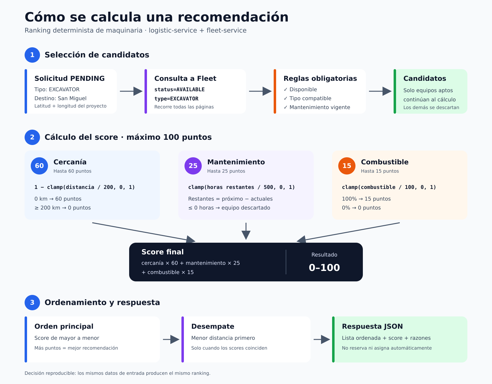

# Algoritmo de recomendación de maquinaria

Este módulo pertenece a `logistic-service` y genera un ranking determinista de
maquinaria para una solicitud logística. El algoritmo no utiliza un LLM para
tomar la decisión: consulta los equipos administrados por `fleet-service`,
descarta los que no cumplen las condiciones operativas y calcula un puntaje de
`0` a `100` para cada candidato.



## Endpoint

```http
GET /api/v1/requests/{requestID}/recommendations
```

La solicitud debe existir y encontrarse en estado `PENDING`.

## Comunicación entre servicios

`logistic-service` consulta el endpoint existente de `fleet-service`:

```http
GET /api/v1/equipments?type=EXCAVATOR&status=AVAILABLE&page=1&pageSize=100
```

Configuración local con Docker Compose:

```yaml
environment:
  FLEET_SERVICE_URL: "http://fleet-service:3000"
```

`FLEET_SERVICE_URL` contiene solamente el esquema, host y puerto. El cliente
agrega internamente `/api/v1/equipments`.

## Flujo del algoritmo

1. Busca la solicitud logística mediante `requestID`.
2. Verifica que su estado sea `PENDING`.
3. Consulta en `fleet-service` la maquinaria `AVAILABLE` del tipo solicitado.
4. Recorre todas las páginas de resultados.
5. Aplica nuevamente las reglas de elegibilidad dentro de Logistics.
6. Calcula distancia, margen de mantenimiento y puntaje por combustible.
7. Suma los tres componentes para obtener un score entre `0` y `100`.
8. Ordena los candidatos de mayor a menor score.
9. Cuando dos candidatos tienen el mismo score, prioriza el más cercano.

## Reglas de elegibilidad

Un equipo solo participa en el ranking cuando cumple todas estas reglas:

```text
status == AVAILABLE
type == request.equipmentType
nextMaintenanceHours - engineHours > 0
```

Aunque Fleet ya filtra por tipo y estado, Logistics repite estas validaciones
para proteger su lógica ante respuestas inesperadas o cambios del servicio
externo.

Los equipos vencidos de mantenimiento se descartan. Un equipo ubicado a más de
`200 km` no se descarta automáticamente, pero recibe `0` puntos por distancia.

## Cálculo de distancia

La distancia geográfica se calcula con la fórmula de Haversine utilizando:

- latitud y longitud del proyecto;
- latitud y longitud actuales de la maquinaria;
- radio terrestre de `6,371 km`.

El resultado representa distancia en línea recta. No considera carreteras,
tráfico, restricciones de transporte ni tiempos reales de traslado.

## Componentes del score

| Componente | Peso máximo | Normalización |
|---|---:|---|
| Cercanía | 60 puntos | `1 - clamp(distanceKm / 200, 0, 1)` |
| Mantenimiento | 25 puntos | `clamp(hoursRemaining / 500, 0, 1)` |
| Combustible | 15 puntos | `clamp(fuelPercent / 100, 0, 1)` |

Donde:

```text
hoursRemaining = nextMaintenanceHours - engineHours
```

La función `clamp(value, 0, 1)` obliga al valor a mantenerse entre `0` y `1`:

```text
value < 0  -> 0
value > 1  -> 1
otro caso  -> value
```

### Fórmula final

```text
distanceFactor    = 1 - clamp(distanceKm / 200, 0, 1)
maintenanceFactor = clamp(hoursRemaining / 500, 0, 1)
fuelFactor        = clamp(fuelPercent / 100, 0, 1)

score = distanceFactor * 60
      + maintenanceFactor * 25
      + fuelFactor * 15
```

Interpretación de los pesos:

- `60%` cercanía: reduce distancia, tiempo y costo potencial de traslado.
- `25%` mantenimiento: evita recomendar maquinaria próxima a detenerse.
- `15%` combustible: favorece equipos listos para iniciar la operación.

## Ejemplo

Solicitud:

```json
{
  "equipmentType": "EXCAVATOR",
  "location": {
    "name": "San Miguel",
    "latitude": 13.4833,
    "longitude": -88.1833
  }
}
```

Candidatos:

| Equipo | Distancia | Horas restantes | Combustible |
|---|---:|---:|---:|
| `EXC-NEAR` | 0.06 km | 500 h | 95% |
| `EXC-FAR` | 159.15 km | 100 h | 60% |

Resultado aproximado:

| Equipo | Cercanía | Mantenimiento | Combustible | Score |
|---|---:|---:|---:|---:|
| `EXC-NEAR` | 59.98 | 25.00 | 14.25 | **99.23** |
| `EXC-FAR` | 12.25 | 5.00 | 9.00 | **26.25** |

`EXC-NEAR` aparece antes porque tiene mayor score. Si cambia a `RESERVED`, deja
de ser elegible y desaparece de la siguiente consulta de recomendaciones.

## Respuesta

```json
{
  "data": {
    "requestId": "d00271c7-6553-4461-97e2-ab6f5132b057",
    "count": 1,
    "recommendations": [
      {
        "equipmentId": "a87277e1-0ab8-42cc-a475-5375de107feb",
        "code": "EXC-NEAR",
        "type": "EXCAVATOR",
        "brand": "Caterpillar",
        "model": "320",
        "capacityTons": 23,
        "location": {
          "name": "San Miguel",
          "latitude": 13.4835,
          "longitude": -88.1828
        },
        "distanceKm": 0.06,
        "engineHours": 100,
        "nextMaintenanceHours": 600,
        "maintenanceHoursRemaining": 500,
        "fuelPercent": 95,
        "score": 99.23,
        "reasons": [
          "Maquinaria disponible",
          "Se encuentra a 0.06 km del proyecto",
          "Tiene 500.00 horas antes del próximo mantenimiento",
          "Nivel de combustible de 95.00%"
        ]
      }
    ]
  }
}
```

## Ordenamiento

```go
sort.SliceStable(result, func(i, j int) bool {
	if result[i].Score == result[j].Score {
		return result[i].DistanceKM < result[j].DistanceKM
	}

	return result[i].Score > result[j].Score
})
```

El score se compara antes de redondearlo para presentación. Esto evita empates
artificiales causados por mostrar solamente dos decimales.

## Respuestas HTTP

| Código | Situación |
|---:|---|
| `200` | Recomendaciones calculadas, incluso si la lista está vacía |
| `400` | `requestID` no es un UUID válido |
| `404` | La solicitud no existe |
| `409` | La solicitud ya no está en estado `PENDING` |
| `502` | Logistics no pudo consultar correctamente a Fleet |

## Lo que no hace todavía

El algoritmo genera candidatos, pero no reserva ni asigna maquinaria. La
asignación operacional debe implementarse como una entidad independiente que
relacione `requestID` con `equipmentID` y confirme el cambio de estado del
equipo en `fleet-service`.

El MVP tampoco considera todavía:

- disponibilidad entre fechas;
- capacidad mínima solicitada;
- costo real de transporte;
- distancia por carretera;
- accesorios compatibles;
- prioridad del cliente o proyecto;
- carga de trabajo histórica de la flota.

## Prueba end-to-end

Con ambos servicios levantados:

```bash
FLEET_BASE_URL=http://localhost:3000/api/v1 \
LOGISTIC_BASE_URL=http://localhost:3001/api/v1 \
./fleet-logistic-e2e-test.sh
```

La prueba crea dos excavadoras, comprueba que ambas aparezcan, verifica que la
más cercana obtenga mayor score y confirma que una maquinaria `RESERVED` ya no
se recomiende.
